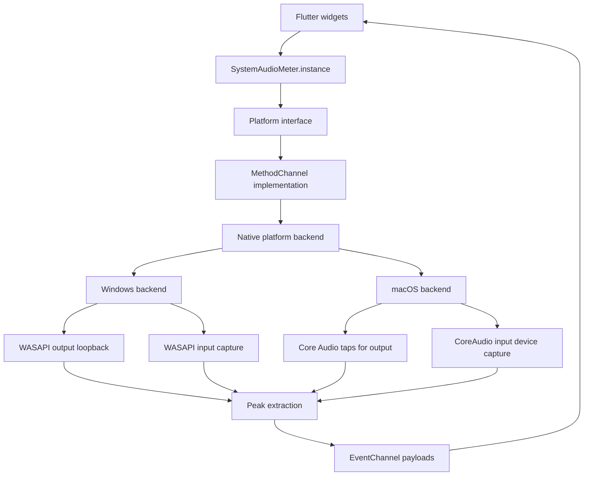
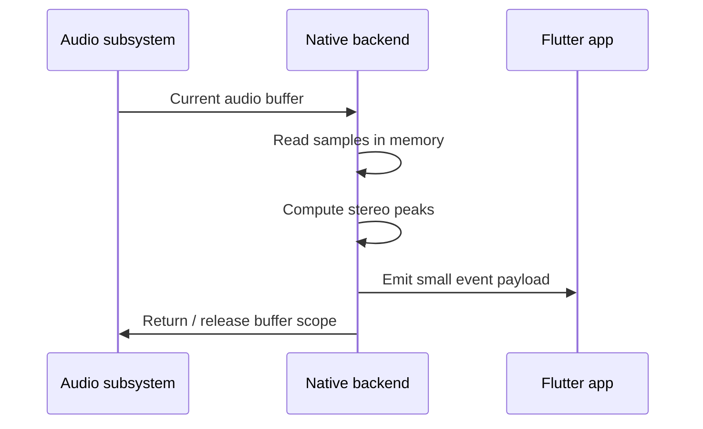

# Architecture

`system_audio_meter` uses a Flutter platform-channel architecture with native desktop backends.

## High-level design

## Flutter layer

The Dart layer provides:

- a stable API surface
- stream access for meter updates
- device queries and device selection
- state inspection for running meters

The Flutter side does not process raw audio. It receives already-normalized values from native code.

## Platform channels

### `MethodChannel`

Used for request/response operations:

- enumerate devices
- select devices
- start metering
- stop metering
- query current device
- query running state

### `EventChannel`

Used for continuous data:

- output meter values
- input meter values
- device lifecycle events

## Windows backend

Windows is built around **WASAPI**.

### Output path

- enumerates render devices
- opens the selected or default render endpoint
- uses WASAPI loopback capture
- computes peak levels from the current packet
- emits normalized stereo values

### Input path

- enumerates capture devices
- opens the selected or default capture endpoint
- uses shared-mode capture
- computes peak levels from the current packet
- emits normalized stereo values

### Device notifications

Windows uses endpoint notifications to:

- detect device add/remove events
- react to default device changes
- reattach active meters when appropriate

## macOS backend

macOS does not offer the same output-loopback mechanism as Windows.

### Output path

macOS output metering uses:

- Core Audio process taps
- a private aggregate device
- IO callbacks on the aggregate device input path

This is the supported design for reading system output audio in modern macOS.

### Input path

macOS input metering uses:

- input-capable CoreAudio devices
- IO callbacks bound to the selected input device

### Device notifications

macOS uses Core Audio property listeners to detect:

- global device list changes
- default input changes
- default output changes
- service resets

## Peak calculation model

Native code:

1. receives the current audio buffer
2. reads only the current frame data needed for metering
3. computes left/right peak values
4. clamps values to `0.0..1.0`
5. emits a compact event payload
6. releases or exits the buffer scope immediately

## Memory behavior

The plugin never retains long-running PCM history.

## Non-goals

The architecture intentionally excludes:

- recording pipelines
- raw buffer retention
- waveform generation
- FFT generation
- LUFS calculation
- audio effects processing

This keeps the plugin small, predictable, and appropriate for UI metering workloads.
