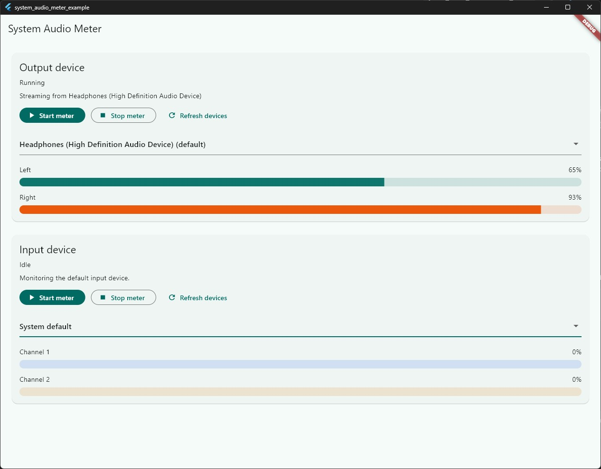
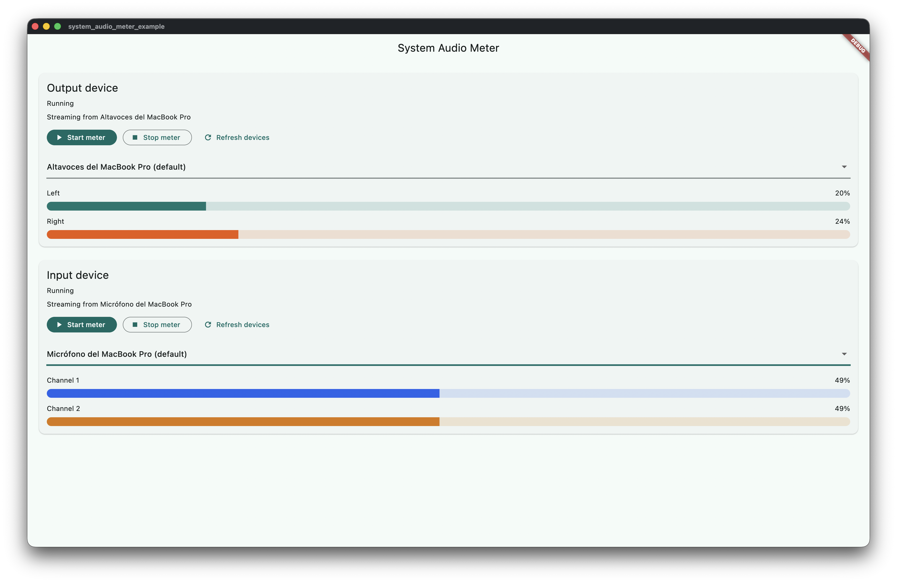
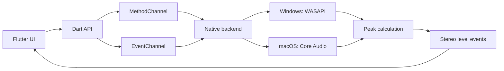

# system_audio_meter

`system_audio_meter` is a Flutter desktop plugin for **real-time audio level visualization**.

It exposes normalized stereo peak levels for:

- system output audio
- microphone and other input devices
- device connection and disconnection events
- optional silence transition events for input and output

The plugin is designed for **desktop visualization**, not audio production tooling. It processes audio in memory only, emits lightweight metering values to Flutter, and releases native buffers immediately after each calculation pass.

## Key capabilities

- Real-time stereo peak meters for desktop Flutter apps
- Output device enumeration and selection
- Input device enumeration and selection
- Device lifecycle events for reconnect-aware UIs
- Optional per-flow silence detection with configurable threshold and duration
- Native Windows backend using WASAPI
- Native macOS backend using Core Audio taps for output and CoreAudio capture for input

## What this plugin does not do

This plugin is intentionally narrow in scope:

- It does **not** record audio.
- It does **not** store audio buffers.
- It does **not** generate FFT data.
- It does **not** generate waveforms.
- It does **not** persist audio to disk.
- It is **not** an audio editor, recorder, or analyzer pipeline.

Instead, it:

- processes audio in memory only
- calculates peak meter values from the current buffer
- releases native buffers immediately after processing
- focuses on real-time UI visualization

## Platform support

| Platform | Status | Notes |
| --- | --- | --- |
| Windows | Supported | WASAPI loopback for output, WASAPI capture for input |
| macOS | Supported | Core Audio taps for output, CoreAudio capture for input, macOS 14.2+ |
| Linux | Pending | Planned for a future PulseAudio/PipeWire backend |

## Typical use cases

- Desktop volume visualizers
- Voice chat overlays
- Streaming dashboards
- System monitor utilities
- Audio-reactive desktop UI
- Device-aware metering panels

## Screenshots

### Windows

### macOS

## Architecture at a glance

## Read next

- [Getting Started](getting-started.md)
- [Installation](installation.md)
- [API Reference](api.md)
- [Architecture](architecture.md)
- [Troubleshooting](troubleshooting.md)
